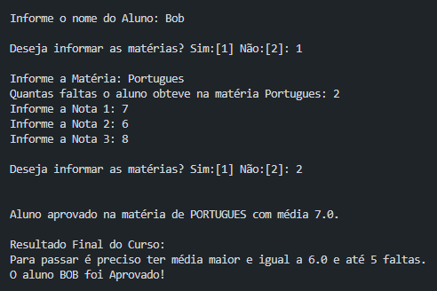

# Back-End - Desafio
## Projeto Back-End com JavaScript
#### Por:  iTalents

### Sobre o Projeto

A aplicação em JavaScript calcula a média de um aluno utilizando funções para organizar o código e aplicar a lógica de programação. A média é obtida somando as notas e dividindo pelo número de avaliações, garantindo clareza e manutenção eficiente.

##### About the project

The JavaScript application calculates a student's average using functions to organize the code and apply programming logic. The average is obtained by adding the scores and dividing by the number of reviews, ensuring clarity and efficient maintenance.

### Ferramentas de Desenvolvimento
##### (Development Tools)

* Visual Studio Code

### Técnicas Utilizadas
##### (Techniques Used)

* JavaScript
* Node Js
* prompt-sync

### Instalar Dependências
##### (Install Dependencies)

``
npm install
``

### Autor (Author)
#### Katarine Albuquerque
###### Desenvolvedora Front-end (Developer)
   
